---
## Front matter
title: "Лабораторная работа №1"
subtitle: "Работа с git"
author: "Галацан Николай, НПИбд-01-22"

## Generic otions
lang: ru-RU
toc-title: "Содержание"

## Bibliography
bibliography: bib/cite.bib
csl: pandoc/csl/gost-r-7-0-5-2008-numeric.csl

## Pdf output format
toc: true # Table of contents
toc-depth: 2
lof: true # List of figures
lot: false # List of tables
fontsize: 12pt
linestretch: 1.5
papersize: a4
documentclass: scrreprt
## I18n polyglossia
polyglossia-lang:
  name: russian
  options:
	- spelling=modern
	- babelshorthands=true
polyglossia-otherlangs:
  name: english
## I18n babel
babel-lang: russian
babel-otherlangs: english
## Fonts
mainfont: IBM Plex Serif
romanfont: IBM Plex Serif
sansfont: IBM Plex Sans
monofont: IBM Plex Mono
mathfont: STIX Two Math
mainfontoptions: Ligatures=Common,Ligatures=TeX,Scale=0.94
romanfontoptions: Ligatures=Common,Ligatures=TeX,Scale=0.94
sansfontoptions: Ligatures=Common,Ligatures=TeX,Scale=MatchLowercase,Scale=0.94
monofontoptions: Scale=MatchLowercase,Scale=0.94,FakeStretch=0.9
mathfontoptions:
## Biblatex
biblatex: true
biblio-style: "gost-numeric"
biblatexoptions:
  - parentracker=true
  - backend=biber
  - hyperref=auto
  - language=auto
  - autolang=other*
  - citestyle=gost-numeric
## Pandoc-crossref LaTeX customization
figureTitle: "Рис."
tableTitle: "Таблица"
listingTitle: "Листинг"
lofTitle: "Список иллюстраций"
lotTitle: "Список таблиц"
lolTitle: "Листинги"
## Misc options
indent: true
header-includes:
  - \usepackage{indentfirst}
  - \usepackage{float} # keep figures where there are in the text
  - \floatplacement{figure}{H} # keep figures where there are in the text
---

# Цель работы

Научиться использовать систему управления версиями git, освоить основные команды, применить на практике полученные знания.

# Теоретическое введение

 Git — распределённая система управления версиями. Проект был создан Линусом Торвальдсом для управления разработкой ядра Linux, первая версия выпущена 7 апреля 2005 года; координатор — Дзюн Хамано. Среди проектов, использующих Git, — ядро Linux, Swift, Android, Drupal, Cairo, GNU Core Utilities, Mesa, Wine, Chromium, Compiz Fusion, FlightGear, jQuery, PHP, NASM, MediaWiki, DokuWiki, Qt, ряд дистрибутивов Linux.

Программа является свободной и выпущена под лицензией GNU GPL версии 2. По умолчанию используется TCP-порт 9418 [@wiki].

# Выполнение лабораторной работы

## Подготовка

Сначала проверяю имя пользователя и электронную почту. Приступаю к настройке `core.autocrlf`,  `core.safecrlf`, `core.quotepath`  (рис. [-@fig:1]).

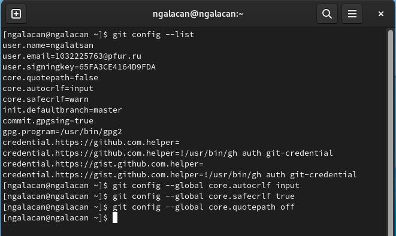{#fig:1 width=70%}

## Создание проекта

Создаю рабочий каталог с файлом `hello.html`. Добавляю запись. Создаю репозиторий и добавляю файл, проверяю текущее состояние. В репозитории хранится текущее состояние рабочего каталога, и нет никаких
изменений, ожидающих записи (рис. [-@fig:2]).

{#fig:2 width=70%}

## Внесение и индексация изменений

Изменяю содержимое файла на `<h1>Hello, World!</h1>`. Проверяю состояние (git знает, что файл `hello.html` был изменен, но при этом эти изменения еще не зафиксированы в репозитории), индексирую изменения и вновь проверяю (изменения файла `hello.html` были проиндексированы. Это означает, что git теперь знает об изменении, но изменение пока не записано в репозиторий) (рис. [-@fig:3]).

{#fig:3 width=70%}

Делаю коммит изменений (рис. [-@fig:4]).

{#fig:4 width=70%}

 Еще раз проверив статус, убеждаюсь, что рабочий каталог чистый. Изменяю страницу «Hello, World!», чтобы она содержала стандартные теги (рис. [-@fig:5]).

{#fig:5 width=70%}

 Теперь добавляю это изменение в индекс git. В `hello.html` добавляю секцию `<head>`:
 
 ```
<html>
   <head>
   </head>
   <body>
       <h1>Hello, World!</h1>
   </body>
</html>
 
 ``` 
 
 Проверяю статус: `hello.html` указан дважды в состоянии. Делаю коммит индексированного изменения, просматриваю статус: осталось только непроиндексированное изменение. Индексирую и проверяю. Делаю еще один коммит (рис. [-@fig:6]).

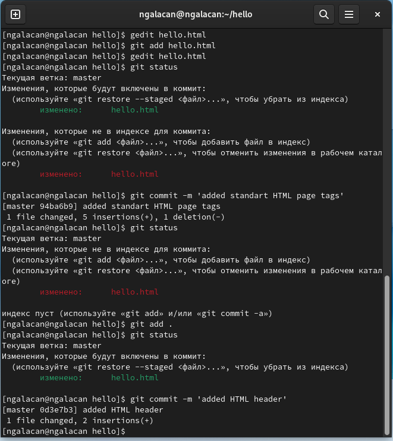{#fig:6 width=70%}

## История

Получаю историю изменений. Просматриваю в разных форматах (рис. [-@fig:7]).

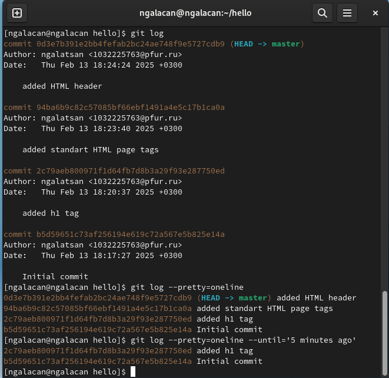{#fig:7 width=70%}
 
## Получение старых версий

Изучаю данные лога и нахожу хэш для первого коммита. Использую этот хэш-код для получения старой версии. Возвращаюсь к последней версии (рис. [-@fig:8]).

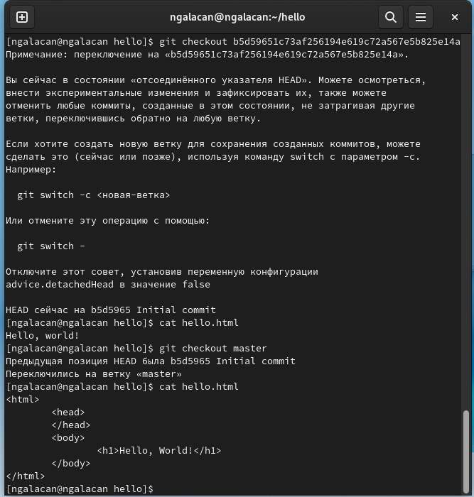{#fig:8 width=70%}

## Создание тегов версий

Создаю тег текущей версии (рис. [-@fig:9]), предыдущей версии и переключаюсь между ними, просматриваю теги (рис. [-@fig:10])

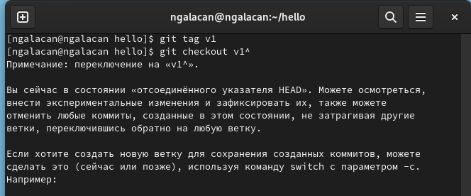{#fig:9 width=70%}

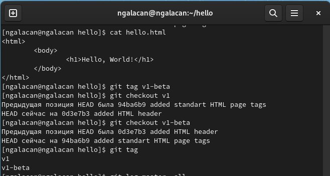{#fig:10 width=70%}

Просматриваю теги в логе. Вижу теги (v1 и v1-beta) в логе вместе с именем ветки (master).
Кроме того HEAD показывает коммит, на который я переключился (на данный
момент это v1-beta) (рис. [-@fig:11]).

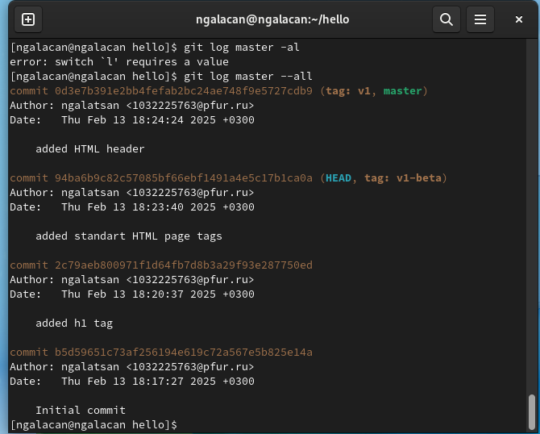{#fig:11 width=70%}

##  Отмена локальных изменений (до индексации)

Переключившись на ветку `master` изменяю файл:

```
<html>
  <head>
  </head>
  <body>
	<h1>Hello, World!</h1>
	<!-- This is a bad comment. We want to revert it. -->
  </body>
</html>

```

Проверяю состояние:  файл `hello.html` был изменен, но еще не проиндексирован. Для переключения версии файла использую команды, проверяю статус, просматриваю файл (рис. [-@fig:12]).

{#fig:12 width=70%}

## Отмена проиндексированных изменений (перед коммитом)

Вновь вношу изменений в файл:

```
<html>
  <head>
  <!-- This is an unwanted but staged comment -->
  </head>
  <body>
	<h1>Hello, World!</h1>
  </body>
</html>
```

Индексирую изменения. Выполняю сброс буферной зоны. Команда `git reset` сбрасывает буферную зону к HEAD. Это очищает буферную
зону от изменений, которые мы только что проиндексировали. Использую команду `git checkout`, чтобы удалить нежелательные изменения в рабочем каталоге (рис. [-@fig:13]).

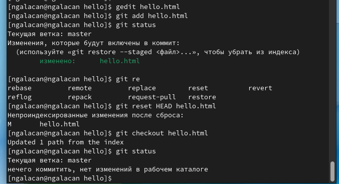{#fig:13 width=70%}

## Отмена коммитов

Изменяю файл:

```
<html>
  <head>
  </head>
  <body>
	<h1>Hello, World!</h1>
	<!-- This is an unwanted but committed change -->
  </body>
</html>

```

Индексирую и коммичу изменение. Чтобы отменить коммит, необходимо сделать коммит, который удаляет изменения, сохраненные нежелательным коммитом (рис. [-@fig:14]).

{#fig:14 width=70%}

Проверив лог, вижу оба коммита (рис. [-@fig:15]).

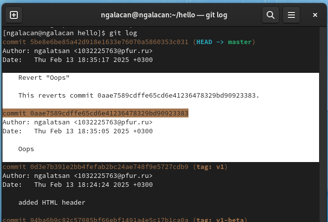{#fig:15 width=70%}

## Удаление коммиттов из ветки

Удаляю последние два коммита с помощью сброса, сначала отметив последний коммит тегом `oops`, чтобы его можно было потом найти. Использую команду `git reset`, чтобы вернуться к версии до этих коммитов. Теперь в логе их нет, но
если посмотретьлоги с опцией `--all` можно всё ещё их увидеть, но метка HEAD находится на нужной версии (рис. [-@fig:16]).

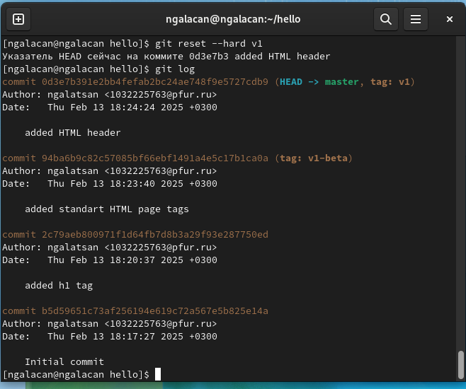{#fig:16 width=70%}

## Удаление тега oops

Удаляю тег и коммиты, на которые он
ссылался, сборщиком мусора (рис. [-@fig:17]).

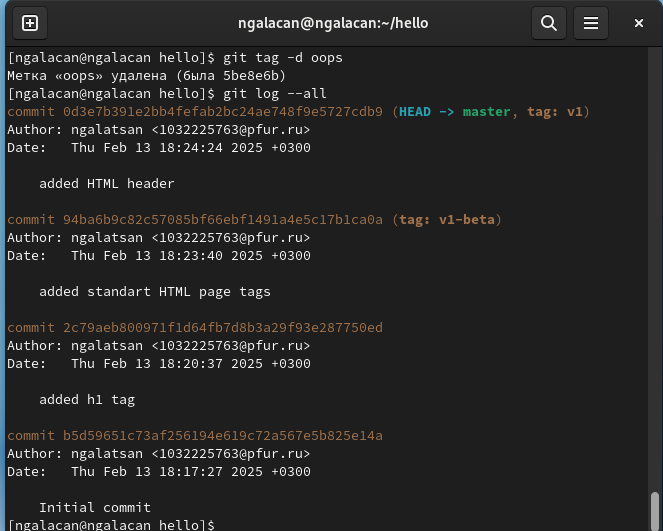{#fig:17 width=70%}

## Внесение изменений в коммиты

Изменяю файл:

```
<!-- Author: N. Galatsan -->
<html>
  <head>
  </head>
  <body>
	<h1>Hello, World!</h1>
  </body>
</html>
```

Индексирую изменения и делаю коммит. Добавляю в файл информацию об электронной почте:

```
<!-- Author: N. Galatsan (1032225763@pfur.ru) -->
<html>
  <head>
  </head>
  <body>
	<h1>Hello, World!</h1>
  </body>
</html>
```

Изменяю предыдущий коммит. Можно увидеть, что оригинальный коммит «автор» заменен коммитом «автор/email». Этого же эффекта можно достичь путем сброса последнего коммита в ветке, и повторного коммита новых изменений (рис. [-@fig:18]).

{#fig:18 width=70%}

## Перемещение файлов

Создаю каталог `lib` и перемещаю туда файл `hello.html` с помощью `git mv`. Делаю коммит, добавляю файл `index.html` (рис. [-@fig:20])  в репозиторий, делаю коммит (рис. [-@fig:19]).

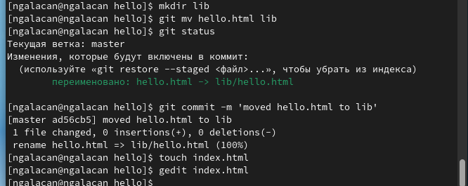{#fig:19 width=70%}

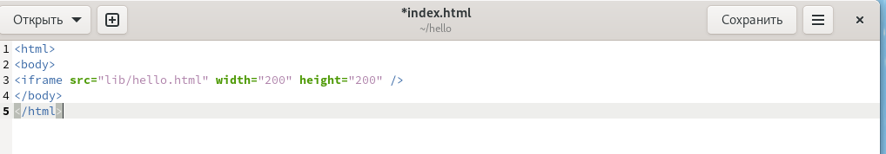{#fig:20 width=70%}

Теперь при открытии `index.html`, можно увидеть кусок страницы `hello` в
маленьком окошке (рис. [-@fig:21]).

{#fig:21 width=70%}


## Git внутри: Каталог .git

Просматриваю данные из каталога `.git`, объектные файлы, ветки, теги и хэш (рис. [-@fig:22]).

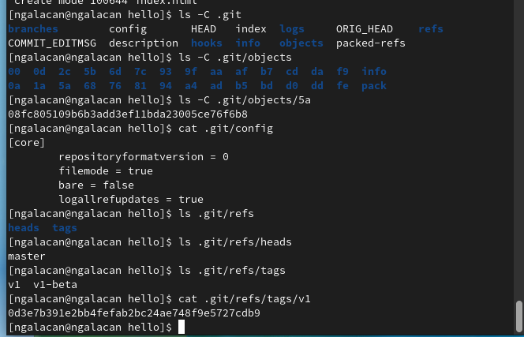{#fig:22 width=70%}

Просматриваю файл `HEAD`, который  содержит ссылку на текущую ветку. Ищу последний коммит. Вывожу последний коммит с помощью SHA1 хэша, просматриваю дерево, каталог `lib`, файл `hello.html` (рис. [-@fig:23]).

{#fig:23 width=70%}

Вручную дохожу до оригинального файла `hello.html` с первого коммита по родительским хэшам и хэшу дерева (рис. [-@fig:24]).

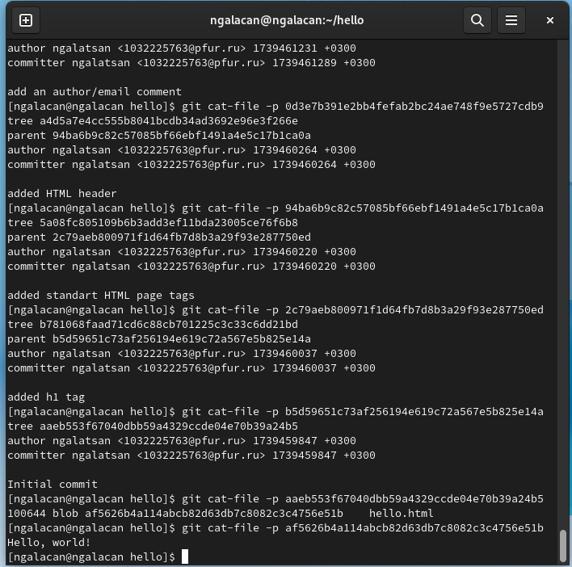{#fig:24 width=70%}

## Создание ветки 

Создаю ветку `style` и добавляю в `lib` файл стилей `style.css`:

```
h1 {
	color: red;
}
```

Индексирую и делаю коммит. Изменяю основную страницу, `index.html`, добавив поддержку стилей (рис. [-@fig:25]).

{#fig:25 width=70%}

В проекте теперье есть две ветки. Просматриваю лог, переключаюсь между ветками (рис. [-@fig:26]).

{#fig:26 width=70%}

## Изменения в ветке master


Создаю `README.md` в ветке `master`, делаю коммит изменений (рис. [-@fig:27]).

{#fig:27 width=70%}

Просматриваю ветки и их отличия (рис. [-@fig:28]).

{#fig:28 width=70%}

## Слияние

Слияние переносит изменения из двух веток в одну. Возвращаюсь к ветке
`style` и сливаю `master` с `style` и просматриваю ветки (рис. [-@fig:29]).

{#fig:29 width=70%}

## Создание конфликта

В ветке `master` изменяю `hello.html`:

<!-- Author: N. Galatsan (1032225763@rudn.ru) -->
<html>
  <head>
    <!-- no style -->
  </head>
  <body>
	<h1>Hello, World! Life is great!</h1>
  </body>
</html>

Делаю коммит, просматриваю ветки, вижу конфликт (рис. [-@fig:30]).

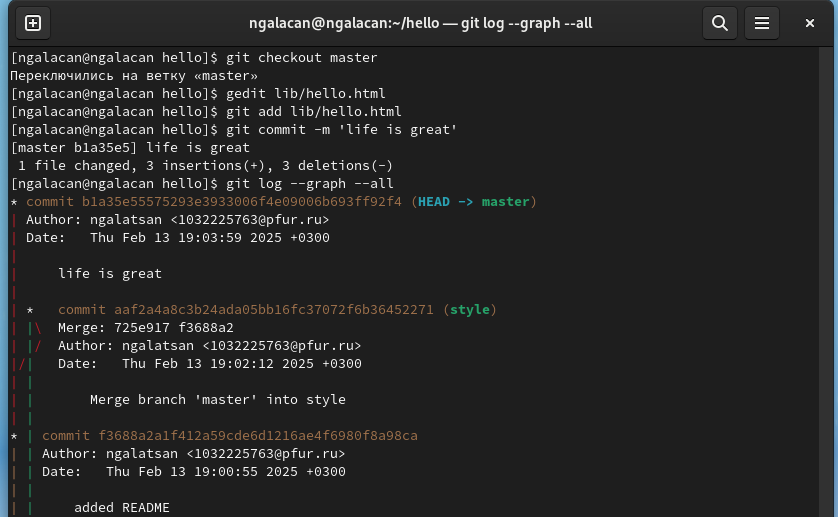{#fig:30 width=70%}

 Возвращаюсь к ветке `style` и пытаюсь объединить ее с новой веткой `master`. В
 файле `lib/hello.html` можно увидеть записи с обеих версий этого файла. Первый
 раздел — версия текущей ветки (`style`). Второй раздел — версия ветки `master`.
 Вношу изменения в `lib/hello.html`, оставив только необходимую запись и
 добавляю этот файл в репозиторий, чтобы вручную разрешить конфликт (рис. [-@fig:31]).

{#fig:31 width=70%}


## Сброс ветки style

Вернемся на ветке `style` к точке перед тем, как мы слили ее с веткой `master`. Можно сбросить ветку к любому коммиту. По сути, это изменение указателя ветки
на любую точку дерева коммитов.
В этом случае мы хотим вернуться в ветке `style` в точку перед слиянием с `master`. Необходимо найти последний коммит перед слиянием. Сделаю сброс по хэшу и проверю (рис. [-@fig:32]).

{#fig:32 width=70%}

## Сброс ветки master

Аналогичным образом сбрасываю и эту ветку (рис. [-@fig:33]).

{#fig:33 width=70%}

## Перебазирование

Используем команду `rebase` вместо команды `merge`. Мы вернулись в точку до первого слияния и хотим перенести изменения из ветки `master` в нашу ветку `style` (рис. [-@fig:34]).

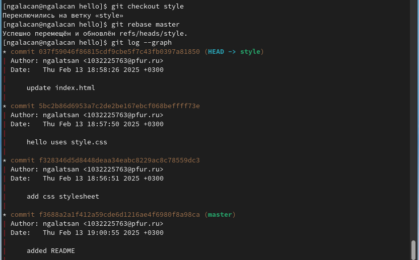{#fig:34 width=70%}


## Слияние в ветку master

Выполняю слияние `style` в `master`. Просматриваю лог. Ветки идентичны (рис. [-@fig:35]).

{#fig:35 width=70%}


## Клонирование репозиториев

Создаю клон первоначального репозитория. Просматриваю его. Просматриваю лог клонированного репозитория. Отображаются все файлы и коммиты оригинального репозитория (рис. [-@fig:36]).

{#fig:36 width=70%}


## Удаленные ветки

Просматриваю подробную информацию о ветках. Просматриваю доступные ветки, затем и удаленные. Git выводит все коммиты в оригинальный репозиторий, но ветки в удаленном
репозитории не рассматриваются как локальные. Если мы хотим собственную ветку
style, мы должны сами ее создать (рис. [-@fig:37]).

{#fig:37 width=70%}


## Изменение оригинального репозитория

Перейдя в оригинальный репозиторий, изменяю README.md:

```
This is the Hello World example from the git tutorial.
```

Добавляю изменение и делаю коммит.

## Извлечение изменений

Перехожу в клон и извлекаю изменения из оригинального репозитория. На данный момент в репозитории есть все коммиты из оригинального репозитория, но они не интегрированы в локальные ветки клонированного репозитория (рис. [-@fig:38]).

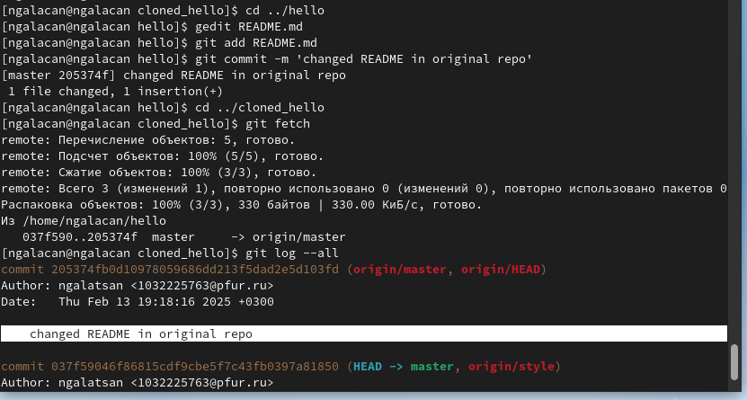{#fig:38 width=70%}

## Слияние извлеченных изменений

Просматриваю README.md. Произвожу слияние и проверяю, что файл на клоне обновился. Вместо извлечения и слияния можно было использовать одну команду: `git pull`(рис. [-@fig:39]).

{#fig:39 width=70%}

## Добавление ветки наблюдения

Добавляю локальную ветку, которая отслеживает удаленную ветку (рис. [-@fig:40]).

{#fig:40 width=70%}

## Чистые репозитории

Создаю чистый репозиторий. Добавляю его к оригинальному репозиторию. В файл README.md вношу изменения:

```
This is the Hello World example from the git tutorial.
(Changed in the original and pushed to shared)


```

Добавляю изменения в `master` и делаю коммит. Отправляю изменения в общий репозиторий (рис. [-@fig:41]).

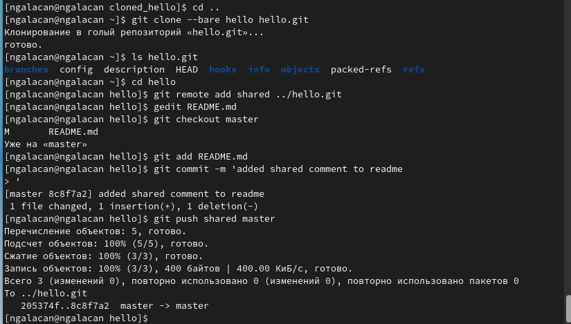{#fig:41 width=70%}

## Извлечение общих изменений

Переключаюсь на клон и добавляю чистый репозиторий. С помощью `git pull shared master` извлекаю изменения. Просматриваю README.md (рис. [-@fig:42]).

{#fig:42 width=70%}


# Выводы

В результате выполнения работы были получены практические навыки использования системы управления версиями git.

# Список литературы{.unnumbered}

::: {#refs}
:::
