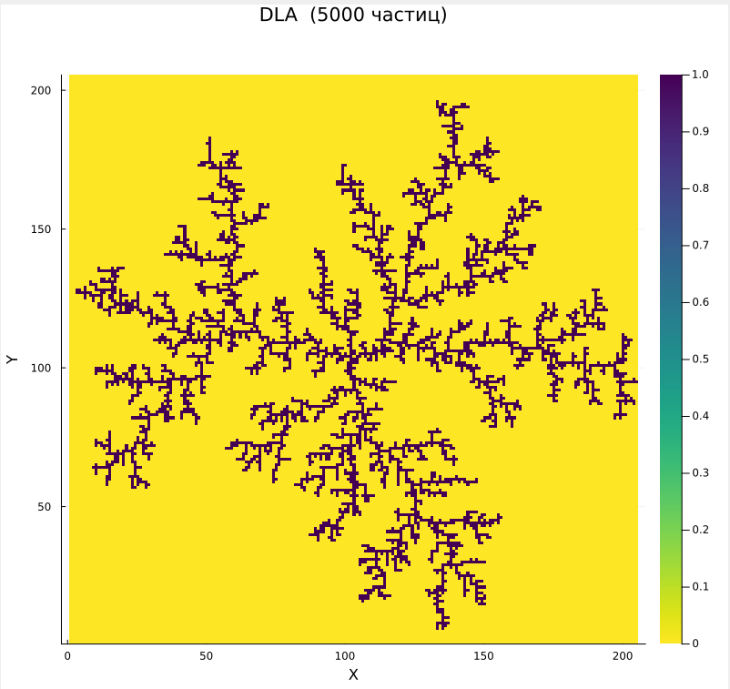

---
## Front matter
lang: ru-RU
title: Групповой проект "Неравновесная агрегация, фракталы". Этап 3
subtitle: Программная реализация проекта
author:
  - Ищенко И. О.,
  - Мишина А. А.,
  - Дикач А. О.,
  - Барсегян В. Л.,
  - Галацан Н. И.,
  - Дудырев Г. А.
institute:
  - Российский университет дружбы народов, Москва, Россия

## i18n babel
babel-lang: russian
babel-otherlangs: english

## Formatting pdf
toc: false
toc-title: Содержание
slide_level: 2
aspectratio: 169
section-titles: true
theme: metropolis
header-includes:
 - \metroset{progressbar=frametitle,sectionpage=progressbar,numbering=fraction}
---

## Состав исследовательской команды

Студенты группы НПИбд-02-22:

- Ищенко Ирина Олеговна
- Мишина Анастасия Алексеевна

И студенты группы НПИбд-01-22:

- Дикач Анна Олеговна
- Барсегян Вардан Левонович
- Галацан Николай Ильич
- Дудырев Глеб Андрееевич

# Вводная часть

**Цель работы**

Реализовать алгоритм моделирования агрегации, ограниченной диффузией (DLA), на языке программирования Julia.

**Задачи**

- Изучить принципы неравновесной агрегации и условия образования фрактальных структур
- Проанализировать математическую модель DLA
- Реализовать DLA и визуализировать смоделированные кластеры

## Алгоритм DLA

1. Инициализация: в центре поля размещается "зародыш" кластера (одна частица).
2. Генерация частицы: новая частица появляется на окружности большого радиуса вокруг кластера.
3. Случайное блуждание: частица перемещается случайным образом (в одном из 8 направлений).
4. Агрегация: если частица касается кластера, она прилипает к нему.
5. Условия остановки:
- Частица уходит слишком далеко → удаляется.
- Достигнуто нужное количество частиц → симуляция завершается

# Программная реализация алгоритма

## Функция `randomAtRadius(radius, seedX, seedY)`

```julia
function randomAtRadius(radius, seedX, seedY)
    theta = 2*pi * rand()
    x = round(Int, radius * cos(theta)) + seedX
    y = round(Int, radius * sin(theta)) + seedY
    return [x, y]
end
```

## Функция `performRandomWalk(location, squareSize)`

```julia
function performRandomWalk(location, squareSize)
    x, y = location
    step = rand((-1, 0, 1), 2)
    new_x = clamp(x + step[1], 1, squareSize)
    new_y = clamp(y + step[2], 1, squareSize)
    return [new_x, new_y]
end
```

## Функция `growDLAcluster(radius, maxParticles)`

```julia
function growDLAcluster(radius, maxParticles)
    squareSize = radius * 2 + 5
    matrix = zeros(Int, squareSize, squareSize)
    center = squareSize ÷ 2
    matrix[center, center] = 1
    
    ...
    
    return matrix
end
```

## Инициализация параметров и моделирование


```julia
radius = 50
maxParticles = 1000

matrix = growDLAcluster(radius, maxParticles)
```

## Визуализация 

```julia
heatmap(matrix, 
    title="DLA ($maxParticles частиц)", 
    xlabel="X", 
    ylabel="Y",
    seriescolor=cgrad(ColorSchemes.viridis, rev=true),
    aspect_ratio=:equal,
    size=(800, 800),
    dpi=300
)
```

# Примеры построения кластеров

## Кластер из 1000 частиц
{#fig:1 width=50%}

## Кластер из 3000 частиц
{#fig:2 width=50%}

## Кластер из 5000 частиц
{#fig:3 width=50%}

## Заключение

Был реализован алгоритм моделирования агрегации, ограниченной диффузией, на языке программирования Julia.
